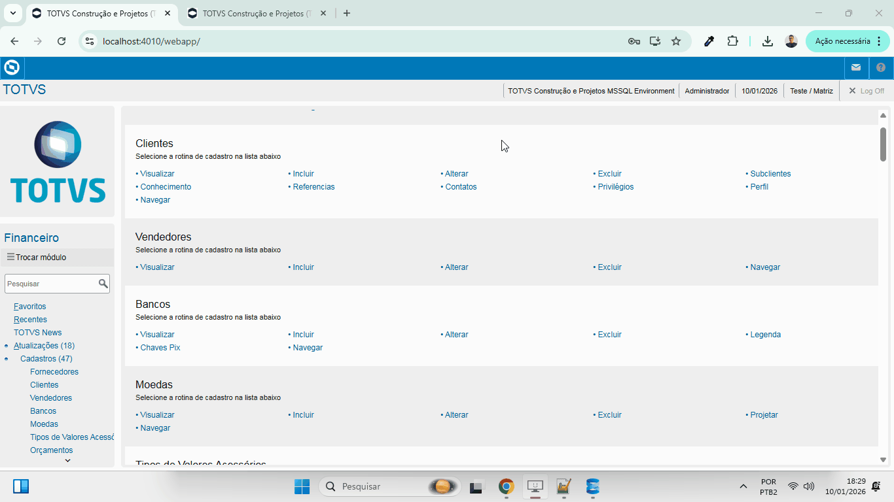
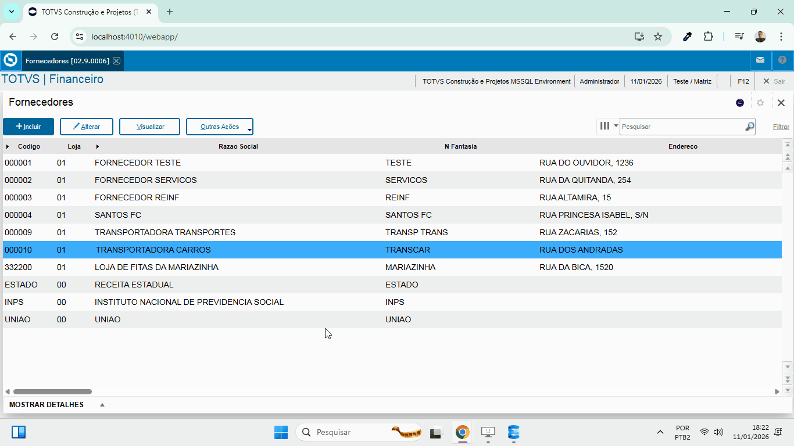
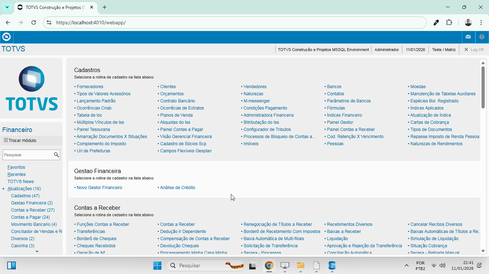
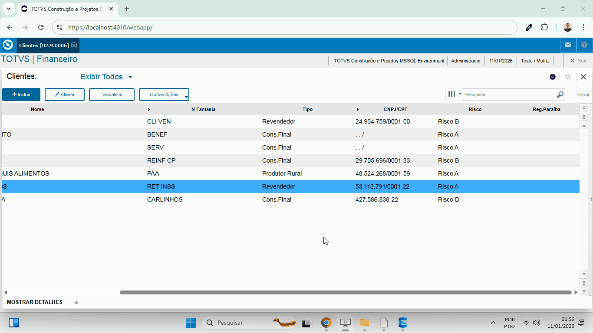
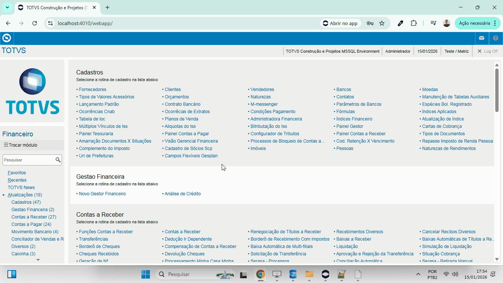
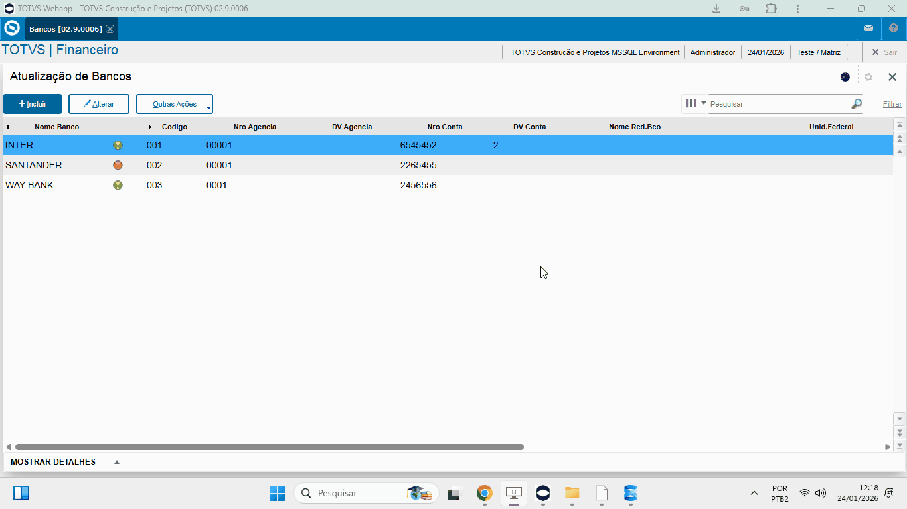
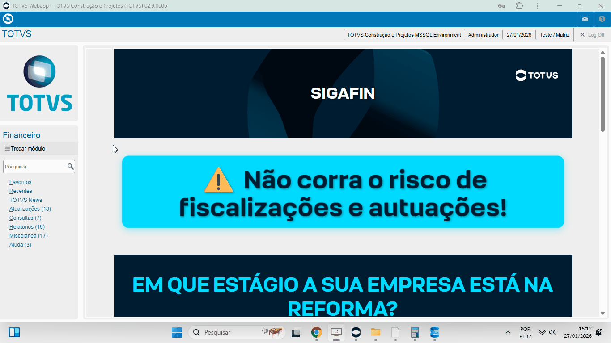

# TOTVS Protheus - Financeiro

Execução das funcionalidades das rotinas e programas do TOTVS Protheus:

<table>
  <thead>
	<tr>
		<th colspan="3">Rotinas de Cadastro e Contas a Receber:</th>
	</tr>
    <tr>
      <th>Rotina:</th>
      <th>Evidência:</th>
	  <th>Programa:</th>
    </tr>
  </thead>

  <tbody>
    <tr>
      <td>Financeiro/Moedas/Tabela SM2</td>
      <td></td>
      <td>MATA090</td>
    </tr>
    <tr>
      <td>Financeiro/Fornecedores/Tabela SA2</td>
      <td></td>
    </tr>
    <tr>
      <td>Financeiro/Clientes/Tabela SA1</td>
      <td></td>
    </tr>
    <tr>
      <td>Financeiro/Clientes/Tabela SA1 - Facilitador</td>
      <td></td>
    </tr>
    <tr>
      <td>Financeiro/Vendedores/Tabela SA3</td>
      <td></td>
    </tr>
    <tr>
      <td>Financeiro/Bancos/Tabela SA6</td>
      <td></td>
    </tr>
    <tr>
      <td>Financeiro/Naturezas/Tabela SED</td>
      <td></td>
    </tr>
    <tr>
      <td>Financeiro/Condições de Pagamento/Tabela SE4/Tipo 1</td>
      <td></td>
    </tr>
    <tr>
      <td>Financeiro/Condições de Pagamento/Tabela SE4/Tipo 2</td>
      <td></td>
    </tr>
	<tr>
      <td>Financeiro/Condições de Pagamento/Tabela SE4/Tipo 3</td>
      <td></td>
    </tr>
	<tr>
      <td>Financeiro/Condições de Pagamento/Tabela SE4/Tipo 4</td>
      <td></td>
    </tr>
	<tr>
      <td>Financeiro/Condições de Pagamento/Tabela SE4/Tipo 5</td>
      <td></td>
    </tr>
	<tr>
      <td>Financeiro/Condições de Pagamento/Tabela SE4/Tipo 6</td>
      <td></td>
    </tr>
	<tr>
      <td>Financeiro/Condições de Pagamento/Tabela SE4/Tipo 7</td>
      <td></td>
    </tr>
	<tr>
      <td>Financeiro/Condições de Pagamento/Tabela SE4/Tipo 8</td>
      <td></td>
    </tr>
	<tr>
      <td>Financeiro/Condições de Pagamento/Tabela SE4/Tipo 9</td>
      <td></td>
    </tr>
	<tr>
      <td>Financeiro/Condições de Pagamento/Tabela SE4/Tipo A</td>
      <td></td>
    </tr>
	<tr>
      <td>Financeiro/Condições de Pagamento/Tabela SE4/Tipo B</td>
      <td></td>
    </tr>
	<tr>
      <td>Financeiro/Visão Gerencial Financeira/Tabelas FJ1,FJ2 e FJ3</td>
      <td></td>
    </tr>
	<tr>
      <td>Financeiro/Contas a Receber/Tabela SE1</td>
      <td></td>
    </tr>
	<tr>
      <td>Financeiro/Contas a Receber/Recebimentos Diversos</td>
      <td></td>
    </tr>
	<tr>
      <td>Financeiro/Contas a Receber/Transferências</td>
      <td></td>
    </tr>
	<tr>
      <td>Financeiro/Contas a Receber/Borderô de Recebimento Com Impostos</td>
      <td></td>
    </tr>
	<tr>
      <td>Financeiro/Contas a Receber/Baixas a Receber/Baixa de Títulos</td>
      <td></td>
    </tr>
	<tr>
      <td>Financeiro/Contas a Receber/Baixas a Receber/Baixa de Títulos Por Lote, Cancelamento e Exclusão da Baixa</td>
      <td></td>
    </tr>
	<tr>
      <td>Financeiro/Contas a Receber/Baixas Automáticas de Títulos a Receber/Baixa e Cancelamento Automática de Títulos</td>
      <td></td>
    </tr>
	<tr>
      <td>Financeiro/Contas a Receber/Borderô de Cheques</td>
      <td></td>
    </tr>
	<tr>
      <td>Financeiro/Contas a Receber/Cheques Recebidos/Tabela SEF/Cadastrar Cheque Baixar Título com Cheque</td>
      <td></td>
    </tr>
	<tr>
      <td>Financeiro/Contas a Receber/Devolução Cheques</td>
      <td></td>
    </tr>
	<tr>
      <td>Financeiro/Contas a Receber/Compensação De Contas A Receber - Parâmetros</td>
      <td></td>
      <td>FINA330</td>
    </tr>
	<tr>
      <td>Financeiro/Contas a Receber/Compensação e Estorno De Contas A Receber</td>
      <td></td>
      <td>FINA330</td>
    </tr>
	<tr>
      <td>Financeiro/Contas a Receber/Compensação Entre Clientes De Contas A Receber</td>
      <td></td>
      <td>FINA330</td>
    </tr>
	<tr>
      <td>Financeiro/Contas a Receber/Liquidação na Tabela FO0</td>
      <td></td>
      <td>FINA460</td>
    </tr>
	<tr>
      <td>Financeiro/Contas a Receber/Liquidação na Tabela FO0 - Filtro</td>
      <td></td>
      <td>FINA460</td>
    </tr>
	<tr>
      <td>Financeiro/Contas a Receber/Funções Contas a Receber</td>
      <td></td>
      <td>FINA740</td>
    </tr>
	<tr>
      <td>Financeiro/Contas a Receber/Relatórios - Liquidação</td>
      <td></td>
      <td>FINR501</td>
    </tr>
  </tbody>
</table>

<table>
	<thead>
		<tr>
			<th colspan="3">Rotinas de Contas a Pagar:</th>
		</tr>
		<tr>
			<th>Rotina:</th>
			<th>Evidência:</th>
			<th>Programa:</th>
		</tr>
	</thead>
	<tbody>
		<tr>
			<td>Financeiro/Contas a Pagar na Tabela SE2</td>
			<td></td>
			<td>FINA050</td>
		</tr>
		<tr>
			<td>Financeiro/Contas a Pagar/Borderô de Pagamentos</td>
			<td></td>
			<td>FINA240</td>
		</tr>
		<tr>
			<td>Financeiro/Contas a Pagar/Borderô Com Impostos</td>
			<td></td>
			<td>FINA241</td>
		</tr>
		<tr>
			<td>Financeiro/Contas a Pagar/Manutenção de Borderô</td>
			<td></td>
			<td>FINA590</td>
		</tr>
		<tr>
			<td>Financeiro/Contas a Pagar/Baixas a Pagar Manual</td>
			<td></td>
			<td>FINA080</td>
		</tr>
		<tr>
			<td>Financeiro/Contas a Pagar/Baixas a Pagar Automática</td>
			<td></td>
			<td>FINA090</td>
		</tr>
		<tr>
			<td>Financeiro/Contas a Pagar/Compensação Entre Carteiras</td>
			<td></td>
			<td>FINA450</td>
		</tr>
		<tr>
			<td>Financeiro/Contas a Pagar/Faturas A Pagar - Aglutinação de Títulos</td>
			<td></td>
			<td>FINA290</td>
		</tr>
		<tr>
			<td>Financeiro/Contas a Pagar/Compensação De Contas a Pagar - P.A.(Pagamento Antecipado) com Titulos em Aberto</td>
			<td></td>
			<td>FINA340</td>
		</tr>
		<tr>
			<td>Financeiro/Contas a Pagar/Liquidação/Renegociação de Dívida</td>
			<td></td>
			<td>FINA565</td>
		</tr>
		<tr>
			<td>Financeiro/Contas a Pagar/Funções Contas a Pagar</td>
			<td></td>
			<td>FINA750</td>
		</tr>
		<tr>
			<td>Financeiro/Contas a Pagar/Relatórios / Títulos a Pagar</td>
			<td></td>
			<td>FINR150</td>
		</tr>
	</tbody>
</table>