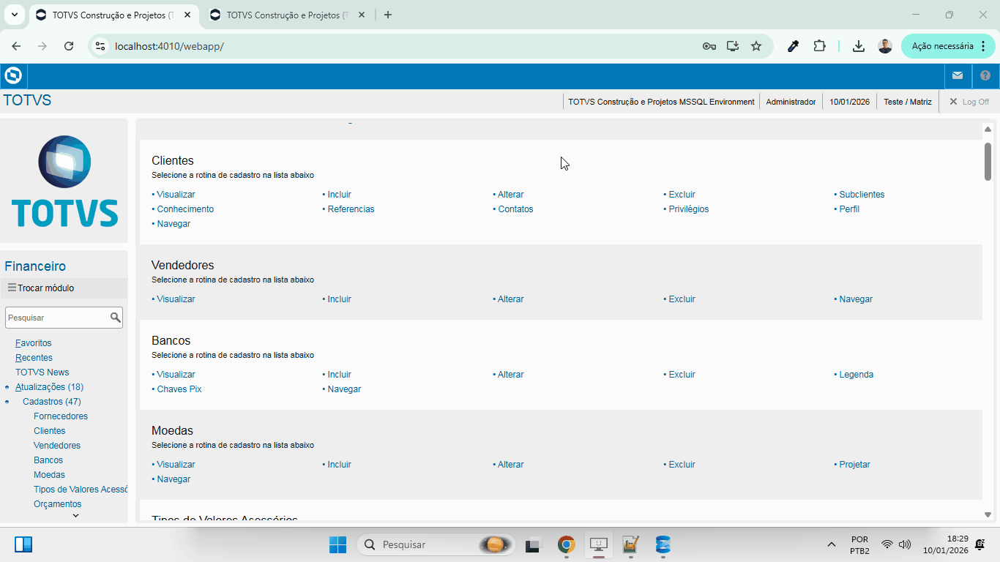
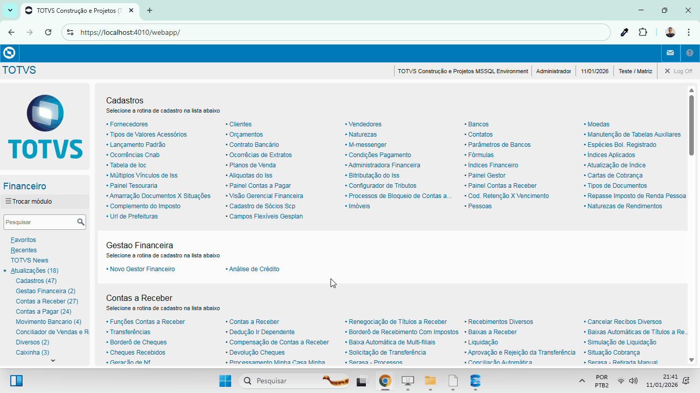
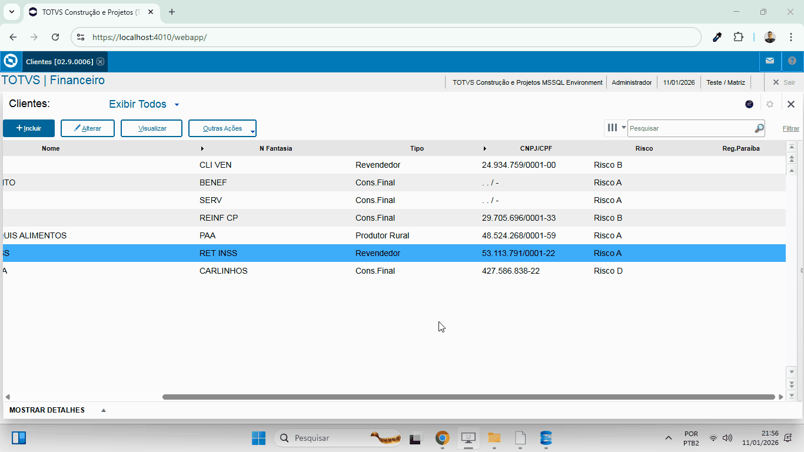
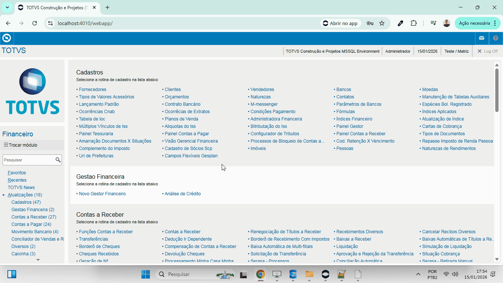

# Protheus

Execução das rotinas no Protheus.

<table>
  <thead>
    <tr>
      <th>Rotina:</th>
      <th>Evidência:</th>
    </tr>
  </thead>

  <tbody>
    <tr>
      <td>Financeiro/Moedas/Tabela SM2</td>
      <td></td>
    </tr>
    <tr>
      <td>Financeiro/Fornecedores/Tabela SA2</td>
      <td></td>
    </tr>
    <tr>
      <td>Financeiro/Clientes/Tabela SA1</td>
      <td></td>
    </tr>
    <tr>
      <td>Financeiro/Clientes/Tabela SA1 - Facilitador</td>
      <td></td>
    </tr>
    <tr>
      <td>Financeiro/Vendedores/Tabela SA3</td>
      <td></td>
    </tr>
  </tbody>
</table>